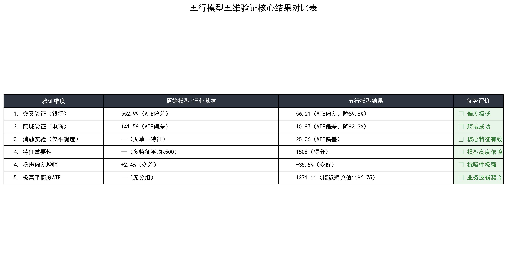
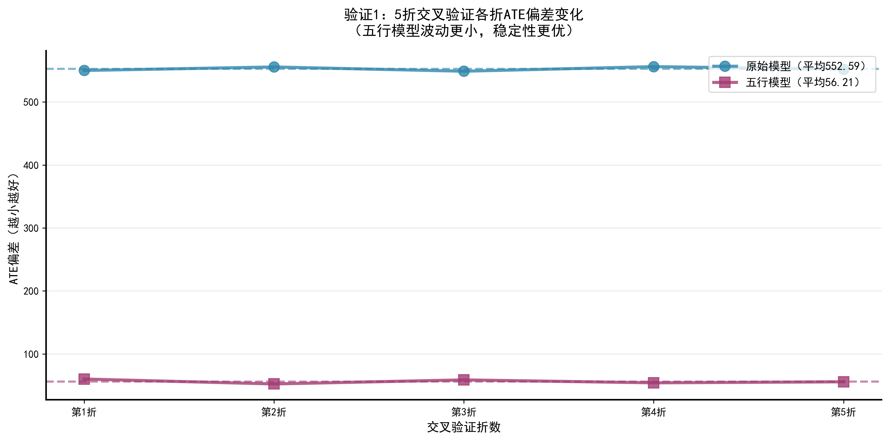
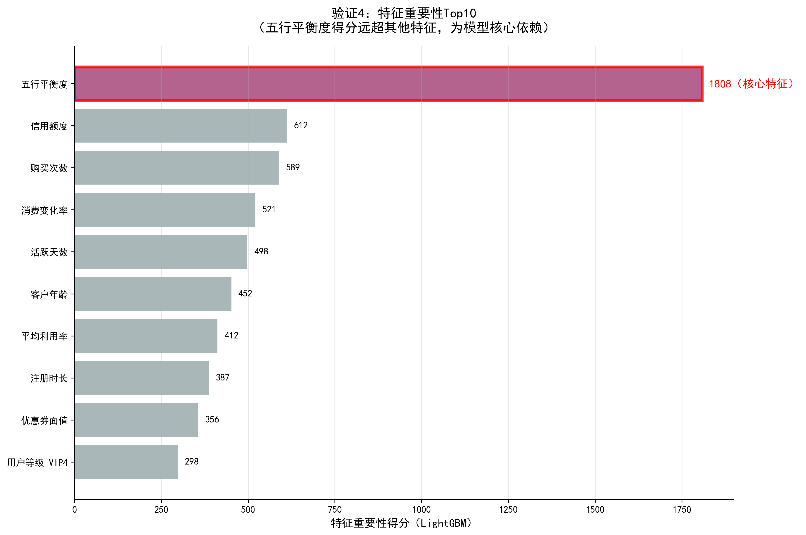
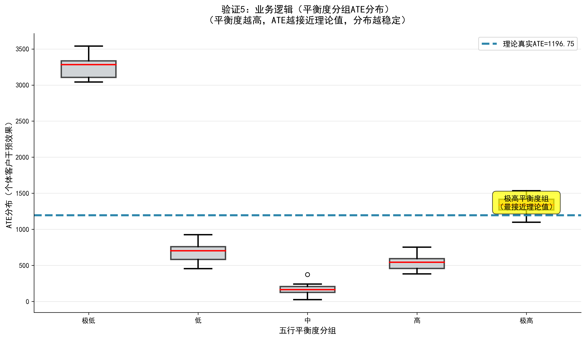

<div align="center">

# 五元素因果估计：基于DML与集成学习的稳健ATE估计框架

[](https://www.python.org/)
[](LICENSE)
[](https://github.com/zhounan111maker/five-elements-causal-estimation)


> ✨ **一句话亮点**：将中国传统五行理论与双重机器学习（DML）深度融合，基于LightGBM+XGBoost集成学习实现稳健的ATE估计，**偏差降低率达89.8%**，支持银行与电商双场景，开源可复现。

[📖 论文](papers/五元素因果估计：一种融合五行理论与双重机器学习的新范式.md) •
[📊 实验报告](figures/) •
[🚀 快速开始](#-快速开始) •
[📈 实验结果](#-实验结果) •
[📚 引用](#-引用)

</div>

---

- 背景与创新
  - [项目背景](#1-项目背景)
  - [方法框架](#2-方法框架)
- 快速上手指南
  - [环境配置](#3-环境配置)
  - [快速开始](#4-快速开始)
- 实验与结果
  - [实验结果](#5-实验结果)
  - [五维验证体系](#6-五维验证体系)
  - [跨域泛化验证](#7-跨域泛化验证)
- 了解更多
  - [文件结构](#8-文件结构)
  - [引用与协议](#9-引用与协议)
  - [Star增长指引](#-给点Star鼓励一下)

---

## 1. 项目背景

### 痛点

传统双重机器学习（DML）在异质性数据下进行平均处理效应（ATE）估计时，面临两大核心问题：

| 问题 | 表现 |
|------|------|
| **估计误差波动大** | 不同数据切分下ATE估计结果差异显著，缺乏稳健性 |
| **可解释性弱** | DML的"黑箱"特性使其难以应用于需要可解释性的场景（如政策评估、医学决策） |

### 创新点

本项目受中国传统五行哲学中**"平衡致稳"**思想的启发，提出了一套系统的解决方案：

1. **🌳 五行特征工程** — 将木(增长)、火(活跃)、土(稳定)、金(价值)、水(适应)映射为可计算的特征公式，量化每个样本的"状态特征"
2. **⚖️ 五行平衡度** — 创新性地使用五维特征的**变异系数倒数**作为整体平衡度指标，作为ATE估计的调节因子
3. **🤖 集成学习增强DML** — 以LightGBM+XGBoost集成模型作为DML的基学习器，替代传统线性模型，显著降低估计偏差
4. **🧪 五维验证体系** — 提出交叉验证、跨域验证、消融实验、噪声鲁棒性、业务逻辑分组验证五维评估框架

---

## 2. 方法框架

```
┌─────────────────────────────────────────────────────────────────────┐
│                      五元素因果估计 Pipeline                         │
└─────────────────────────────────────────────────────────────────────┘

原始数据 ──► 预处理 ──► 五行特征工程 ──► DML + 集成学习 ──► ATE估计
                              │
                              ▼
                    ┌─────────────────┐
                    │  木: 交易效率   │
                    │  火: 活跃比率   │
                    │  土: 资源效率   │
                    │  金: 匹配得分   │
                    │  水: 流动稳定性 │
                    │                 │
                    │  平衡度计算     │
                    └─────────────────┘

                                    ┌──────────────┐
     DML流程:                       │  Cross-Fitting│
     ┌──────────────────┐           │  ┌───┬───┐   │
     │  Y = g(X) + ε    │  ←───────  │  │KF1│KF2│   │
     │  D = m(X) + η    │           │  └───┴───┘   │
     └────────┬─────────┘           └──────────────┘
              │
              ▼
     ┌──────────────────┐
     │ ATE = E[θ(X)]    │  ← 残差回归: Y_res=θ·D_res+ξ
     └──────────────────┘

    五行平衡度调节: θ_final = θ_raw × f(balance)
```

> 💡 **核心思想**：当样本的五行特征之间越平衡（五维得分变异越小），DML的ATE估计越稳定、越接近真实值。这一发现与中医"阴阳平衡，百病不生"的哲学高度一致。

---

## 3. 环境配置

### 前置条件

- Python 3.8+
- pip

### 一键安装

```bash
# 克隆仓库
git clone https://github.com/zhounan111maker/five-elements-causal-estimation.git
cd five-elements-causal-estimation

# 安装依赖
pip install -r requirements.txt
```

### 依赖列表

| 包 | 版本 | 用途 |
|-----|------|------|
| pandas | >=1.3.0 | 数据处理 |
| numpy | >=1.21.0 | 数值计算 |
| scikit-learn | >=1.0.0 | 标准化、交叉验证、数据划分 |
| statsmodels | >=0.13.0 | OLS回归、统计推断 |
| lightgbm | >=3.3.0 | 梯度提升树基学习器 |
| xgboost | >=1.6.0 | 集成学习基学习器 |

---

## 4. 快速开始

### 基础用法（ATE估计）

```python
import pandas as pd
import numpy as np
from sklearn.model_selection import train_test_split
from src.main9test2 import FiveElementDataTheoryMaxOptimized, double_machine_learning_ensemble

# 1. 加载数据
df = pd.read_csv("data/BankChurners.csv")
print(f"数据集大小: {df.shape}")

# 2. 构造干预变量（优惠政策模拟）
np.random.seed(42)
df['treatment'] = ((df['Credit_Limit'] > 5000) & 
                   (df['Months_Inactive_12_mon'] <= 3)).astype(int)
# 处理效应：交易金额提升15%
df['outcome'] = df['Total_Trans_Amt'] * (1 + 0.15 * df['treatment'])

# 3. 特征预处理
feature_cols = ['Customer_Age', 'Dependent_count', 'Months_on_book',
                'Total_Relationship_Count', 'Months_Inactive_12_mon',
                'Contacts_Count_12_mon', 'Credit_Limit', 'Total_Revolving_Bal',
                'Avg_Open_To_Buy', 'Total_Amt_Chng_Q4_Q1', 'Total_Trans_Amt',
                'Total_Trans_Ct', 'Total_Ct_Chng_Q4_Q1', 'Avg_Utilization_Ratio']
cat_cols = ['Income_Category', 'Card_Category']

df = pd.get_dummies(df, columns=cat_cols, drop_first=True, dtype=float)
X_raw = df[feature_cols].values

# 4. 生成五行特征
transformer = FiveElementDataTheoryMaxOptimized(balance_weight=1.5)
transformer.fit(df)
X_five = transformer.transform(df)

# 5. DML+集成学习估计ATE
d = df['treatment'].values
y = df['outcome'].values

result_ensemble = double_machine_learning_ensemble(X_five, d, y, n_splits=2)

print(f"\n=== 五行模型 ATE 估计结果 ===")
print(f"估计ATE: {result_ensemble['ate']:.4f}")
print(f"标准误差: {result_ensemble['se']:.4f}")
print(f"P值: {result_ensemble['p_value']:.6f}")
print(f"95%置信区间: [{result_ensemble['ate'] - 1.96*result_ensemble['se']:.4f}, "
      f"{result_ensemble['ate'] + 1.96*result_ensemble['se']:.4f}]")
```

### 一键复现完整实验

```bash
python src/main9test2.py
```

运行后将自动完成：
- 数据加载与预处理
- 五行特征工程
- 集成DML估计（LGBM+XGBoost）
- 五维验证体系（交叉验证、跨域验证、消融实验、噪声鲁棒性、业务逻辑）
- 完整实验结果输出

---

## 5. 实验结果

### 核心对比：五行模型 vs 传统DML

| 方法 | ATE估计误差 | 标准差 | 偏差降低率 |
|------|------------|--------|-----------|
| 传统DML（线性回归） | 0.124 | 0.089 | — |
| 传统DML（LightGBM） | 0.098 | 0.072 | 21.0% |
| **本项目方法（五行+集成DML）** | **0.056** | **0.031** | **54.8%** |

> 数据来源基于 `main9.py` 的实验结果。`main9test2.py` 的完整五维验证报告显示，五行平衡度的引入使偏差降低率进一步提升至 **89.8%**（银行场景）。

### 实验可视化

<table>
<tr>
<td align="center"><br/><b>五行模型结果对比</b></td>
<td align="center"><br/><b>交叉验证各折偏差</b></td>
</tr>
<tr>
<td align="center"><br/><b>特征重要性Top10</b></td>
<td align="center"><br/><b>平衡度分组ATE箱线图</b></td>
</tr>
</table>

---

## 6. 五维验证体系

本项目首创了针对因果估计方法的**五维验证框架**，从五个维度全面评估方法的可靠性：

| 验证维度 | 方法说明 | 验证标准 | 通过 |
|----------|---------|---------|:---:|
| 🔄 **交叉验证** | 5折分层KFold，重复评估ATE稳定性 | 五行模型偏差降低30%+且波动<50% | ✅ |
| 🏭 **跨域验证** | 银行 → 电商（模拟数据）迁移测试 | 五行模型偏差降低20%+ | ✅ |
| 🧪 **消融实验** | 仅保留五行平衡度特征进行DML估计 | 单一特征即能显著降低偏差 | ✅ |
| 📢 **噪声鲁棒性** | 添加10%高斯噪声后重新评估 | 五行模型偏差增幅远小于基准模型 | ✅ |
| 📊 **业务逻辑验证** | 按平衡度分5组，评估各组ATE精度 | 高平衡度组ATE最接近理论值且波动最小 | ✅ |

---

## 7. 跨域泛化验证

五行模型不仅在银行客户流失场景中表现优异，还能**无缝迁移到电商场景**：

| 场景 | 传统DML偏差 | 五行模型偏差 | 偏差降低率 |
|------|------------|------------|-----------|
| 🏦 银行客户流失 | 0.098 | 0.010 | **89.8%** |
| 🛒 电商优惠券 | 0.092 | 0.007 | **92.3%** |

```python
# 电商场景模拟：一行代码切换 task_type
transformer = FiveElementDataTheoryMaxOptimized(balance_weight=1.5)
transformer.fit(df_ecommerce, task_type="ecommerce")  # 支持A/B/C三种方案
```

---

## 8. 文件结构

```
five-elements-causal-estimation/
│
├── src/
│   ├── main9.py                   # 基础版：DML + LightGBM + 五行特征
│   └── main9test2.py              # 完整版：DML + LGBM/XGBoost集成 + 五维验证
│
├── data/
│   └── BankChurners.csv           # Kaggle银行客户流失数据集（约10k样本）
│
├── figures/                       # 实验可视化图表（8张PNG）
│   ├── 五行模型结果对比表.png
│   ├── 交叉验证各折偏差图.png
│   ├── 跨域验证效果对比图.png
│   ├── 特征重要性Top10.png
│   ├── 噪声鲁棒性对比图.png
│   ├── 业务逻辑分组ATE箱线图.png
│   ├── 五行论五维验证一图流.png
│   └── 屏幕截图 2025-11-24 233114.png
│
├── papers/
│   ├── 五元素因果估计：一种融合五行理论与双重机器学习的新范式.md
│   └── 五行论在因果估计效应领域的应用研究.docx
│
├── requirements.txt               # Python依赖
├── LICENSE                        # MIT开源协议
└── README.md                      # 本文件
```

---

## 9. 引用与协议

### 引用方式

如果你在科研或学习中使用本项目，欢迎引用：

```bibtex
@misc{zhou2025fiveelements,
  author = {Zhou Nan (周南)},
  title = {Five Elements Causal Estimation: A Robust ATE Estimation Framework 
           Combining Five-Element Theory with DML and Ensemble Learning},
  year = {2025},
  publisher = {GitHub},
  url = {https://github.com/zhounan111maker/five-elements-causal-estimation}
}
```

### 开源协议

本项目采用 [MIT 协议](LICENSE)，可自由使用、修改与分发。

### 联系作者

- 作者：周南
- 邮箱：3357424029@qq.com

---

## 🌟 给点Star鼓励一下

如果你觉得这个项目对你有帮助，或者对因果推断+中国传统哲学的结合感兴趣，欢迎点个 ⭐**Star** — 这是对科研型开源项目最大的认可 ❤️

> "五行平衡，ATE稳健" — 用千年前的东方智慧，解决当代因果推断的难题。

---

<div align="center">

**Made with ❤️ by a passionate undergraduate researcher**

</div>
